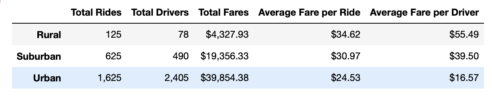
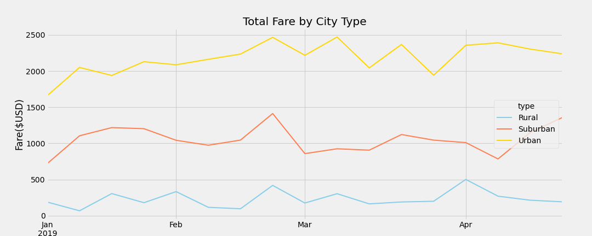

# **PyBer Analysis**

## **Overview:**

The purpose of this project is to analyze and visualize data for Pyber, a ridesharing app company to study the relationship between the type of city and the number of drivers, riders and total fares by city type. The analysis would provide key information to Pyber to determine access and affordability of ridesharing services in different areas. 

Here we are creating a summary dataframe of the ride sharing data by city type and calculating the total weekly fares by city type.

## **Results:**

### __Pyber Summary Dataframe:__

First, we begin by creating a summary dataframe of the ride sharing data by city type. The same can be seen below:

 

- It can be seen that urban cities have the maximum number of rides, drivers and total fares, while the rural areas have the least.
- The Average fare per ride and the average fare per driver is highest in the rural areas and least in the urban areas.
- The difference in the parameters: Total Rides, Total Drivers, Total Fares and average fare per driver are all pretty signigicant between each city type.

### __Total weekly fare by City Type:__

The following line chart indicates the total weekly fares by city type for the period Jan to April 2019. The same can be viewed here as well: [Pyber_fare_summary](analysis/PyBer_fare_summary.png).

 

 - From the line chart it can be observed that the urban cities have the most weekly total fare, while the rural areas have the least.
 - The difference in weekly total fare between each city type is quite significant.
 - The difference between the highest weekly total fare and the lowest weekly total is highest in Urban cities, and lowest in Rural cities. 
 - The graph for weekly total fares is much flatter for Rural areas than the graph for Urban and Suburban cities which have more dynamic graphs with ups and downs.
 - The month of January sees a slow increase in total fares for Urban cities, a rise and fall for Suburban cities and mild ups and downs for Rural areas.
 - All 3 city types have a spike in their weekly total fare around the last week of February.
 - The month of March has a flat graph for Suburban and Rural areas while the urban cities have quite a few spikes in total fares.
 - In April, the urban cities have a mild rise and fall, the rural areas have a significant fall, while the Suburban areas have a rise in total fares.

## **Summary:**

The following recommendations can be made to address the disparities in the ride sharing data among the different city types:

- The urban areas have more drivers than riders - a surplus of drivers. It seems to indicate that there is more supply than demand leading a very low average fare per driver. Pyber may need to limit the number of drivers in the urban cities to what is required to cater to the demand there and redirect their resources to the rural areas. This will in turn cut costs and generate more revenue from Rural areas.

- The Average fare per ride is quite high in the rural areas, which may affect demand. The fares may need to be reduced to increase affordability for rural consumers.This may lead to higher demand and increased revenue from rural areas.

- The pattern for weekly Total fares in the suburban areas is flat with significant spikes at certain times. This pattern can be studied to see if it repeats itself seasonally. This may indicate seasonal increases in demand in the suburban cities. The allocation of drivers can be planned according to that, to maximize revenue based on seasonal trends.

